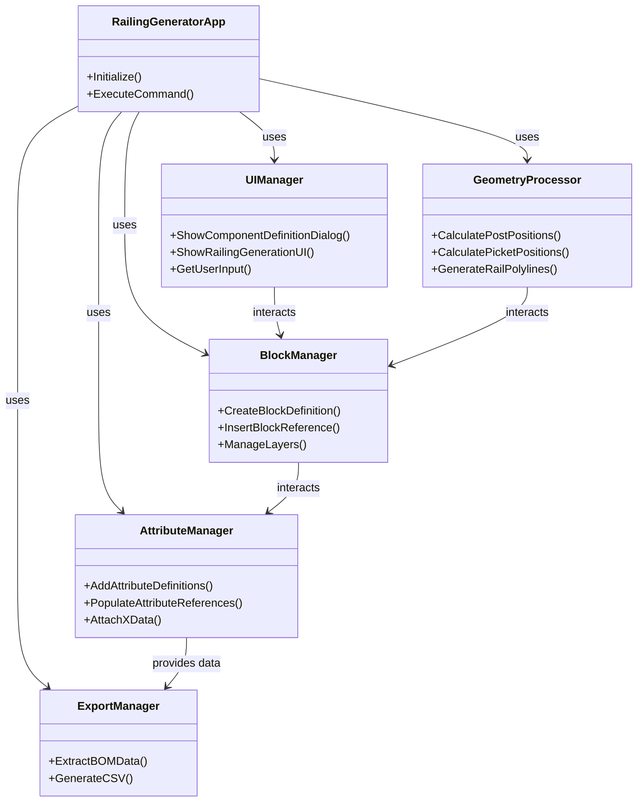

# AutoCAD Railing Generator Architecture

## Overview
This document outlines the modular architecture for the AutoCAD Railing Generator, designed to align with SAPPO principles such as :ModularDesign to mitigate :ScalabilityBottleneck. The architecture is divided into distinct modules to ensure loose coupling and high cohesion, facilitating scalability and maintainability.

## Modules
- **UI Module**: Handles user interactions, including command initiation and input collection via WinForms dialogs.
- **Geometry Module**: Manages 2D geometry creation and manipulation, including polyline path processing and component positioning.
- **Blocks Module**: Responsible for creating and managing AutoCAD Block Definitions and References for components and assemblies.
- **Attributes Module**: Manages attribute data for components, ensuring consistency in BOM and cut list data embedding.
- **Export Module**: Facilitates data export to CSV format for external use, ensuring compatibility with BOM scripts.

## Mermaid Class Diagram
Below is the Mermaid class diagram representing the modular architecture of the AutoCAD Railing Generator:

## SAPPO Principles Applied
- **:ModularDesign**: The architecture is split into independent modules (UI, Geometry, Blocks, Attributes, Export) to ensure that changes in one module have minimal impact on others, mitigating :ScalabilityBottleneck.
- **:ComponentRole**: Each module has a defined role, enhancing clarity and responsibility segregation.
- **:ExceptionHandlingPattern**: Error handling is integrated across modules to manage :UserInputError and :ValidationError effectively.

This architecture supports the immediate Code->Test->Fix cycle by providing clear boundaries for Targeted Testing Strategy, focusing on Core Logic Testing and Contextual Integration Testing.