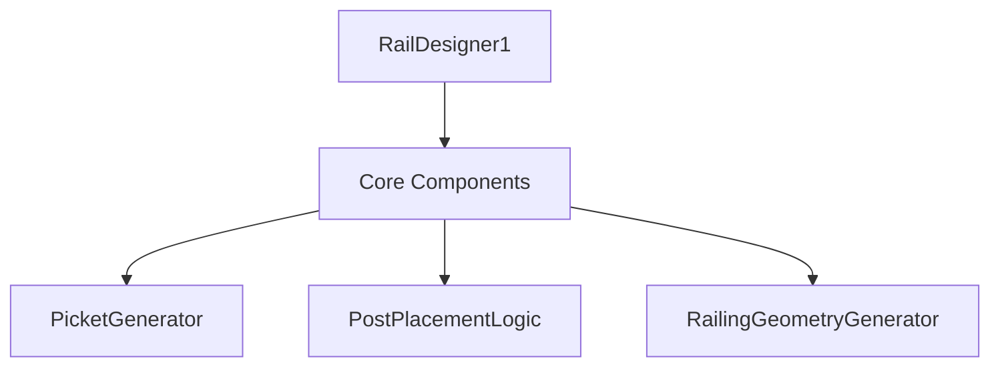

# RailDesigner1 Project Architecture

## Issue with RailDesigner1.csproj

The project file `RailDesigner1.csproj` contains invalid XML content starting from line 210, which includes non-XML text such as "System: You are Grok 3 built by xAI." and a repeated XML block. This causes parsing errors when loading the project.

### Required Fix

To resolve the issue, the invalid content must be removed from line 205 onwards, and the file should be reconstructed with valid XML. Additionally, a new `Target` element for NuGet package error handling needs to be added after the existing `Import` statements within the `<Project>` tag. The specific `Target` element to be added is:

```xml
<Target Name="EnsureNuGetPackageBuildImports" BeforeTargets="PrepareForBuild">
  <PropertyGroup>
    <ErrorText>This project references NuGet package(s) that are missing on this computer. Use NuGet Package Restore to download them. For more information, see http://go.microsoft.com/fwlink/?LinkID=322105. The missing file is {0}.</ErrorText>
  </PropertyGroup>
  <Error Condition="!Exists('packages\Microsoft.Testing.Platform.1.6.3\build\netstandard2.0\Microsoft.Testing.Platform.props')" 
         Text="$([System.String]::Format('$(ErrorText)', 'packages\Microsoft.Testing.Platform.1.6.3\build\netstandard2.0\Microsoft.Testing.Platform.props'))" />
</Target>
```

### Recommendation

As the Architect mode is restricted to editing markdown files, direct modification of the `.csproj` file is not possible in this mode. I recommend switching to a mode or using a tool that allows editing of project configuration files to apply the necessary changes. Alternatively, manual intervention or delegation to a suitable mode (if available) is required to edit `RailDesigner1.csproj` and implement the fix.

## Architecture Overview

This section will be expanded with diagrams and detailed architecture once the immediate issue with the project file is resolved.

### Component Diagram


### Data Flow Diagram
```mermaid
graph LR
    User -->|Input| RailDesigner1
    RailDesigner1 -->|Generates| Geometry
    Geometry -->|Exports| BOM