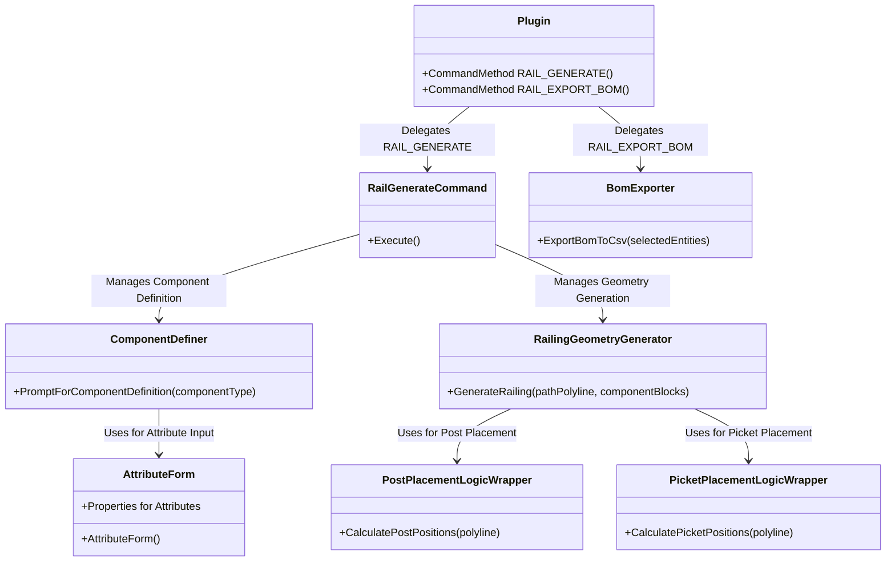

# Class Structure Diagram for RailDesigner1

## Overview
This document outlines the class structure for RailDesigner1, an AutoCAD plugin designed for generating 2D railing systems. The architecture adheres to the requirements specified in the Product Requirements Document (PRD) and follows a modular design to ensure maintainability, usability, and integration with AutoCAD APIs. The class diagram below represents the key components, their responsibilities, and relationships.

## Class Diagram
The class structure is represented using Mermaid syntax for clarity and visual rendering. It includes classes for command handling, component definition, user interface, geometry generation, placement logic, and data export.

## Class Descriptions and Responsibilities

- **Plugin.cs**: Serves as the entry point for AutoCAD commands. Defines command methods `RAIL_GENERATE` and `RAIL_EXPORT_BOM`, delegating the actual logic to specialized classes.
- **RailGenerateCommand.cs**: Orchestrates the main flow of the `RAIL_GENERATE` command, managing the sequence of component definition, polyline selection, and railing generation.
- **ComponentDefiner.cs**: Handles the logic for defining railing components by prompting users for geometry selection, base point, and attribute data. It creates AutoCAD Block Definitions from selected geometry.
- **AttributeForm.cs**: A WinForms dialog for collecting component attributes. Dynamically adjusts fields based on component type (e.g., Post, Picket, Rail) and returns attribute values.
- **RailingGeometryGenerator.cs**: Generates 2D railing geometry along a selected polyline using defined component blocks and placement logic wrappers. Inserts Block References for posts and pickets and creates Polylines for rails.
- **PostPlacementLogicWrapper.cs**: Wraps the preserved post placement logic from `RailCreator_Roo` (`PostGenerator.cs`), adapting inputs and outputs for use in geometry generation.
- **PicketPlacementLogicWrapper.cs**: Wraps the preserved picket placement logic from `RailCreator_Roo` (`PicketGenerator.cs`), ensuring accurate placement calculations without modifying the original logic.
- **BomExporter.cs**: Implements the `RAIL_EXPORT_BOM` command to extract data from generated entities and export a Bill of Materials (BOM) to a CSV file.

## Design Notes
- **Modularity**: The design separates concerns into distinct classes for command flow, UI interaction, geometry processing, and data export, adhering to the PRD's non-functional requirement for maintainability (NFR 3.3).
- **Integration with AutoCAD**: Classes interact with AutoCAD APIs for entity manipulation, selection, and data management (e.g., XData, Attributes), ensuring compatibility with AutoCAD 2025 and .NET 4.8 (NFR 3.4).
- **Preservation of Logic**: Placement logic for posts and pickets is encapsulated in wrapper classes to maintain integrity of the original algorithms from `RailCreator_Roo` (NFR 3.7).
- **Relationships**: The diagram illustrates a clear dependency flow from command initiation to detailed implementation, ensuring a logical sequence of operations as outlined in the PRD.

This class structure provides a robust foundation for implementing the RailDesigner1 plugin, meeting both functional and non-functional requirements while maintaining flexibility for future enhancements.